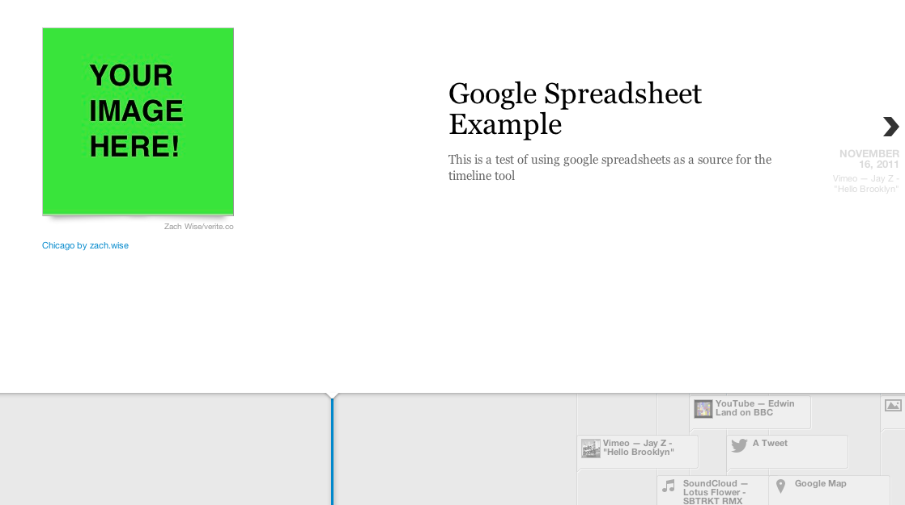

# CalFresh timeline
This timeline shows what it's like to be a [CalFresh](http://www.sfhsa.org/154.htm) (Food Stamps) client in San Francisco for a year.

Check it out! http://lippytak.github.io/calfresh/

# Want to know more?
This info was gathered by a team of 2013 Code for America fellows as part of a project with the San Francisco Human Service Agency. See [promptly.io](http://promptly.io) for details on that project. We built the timeline using [TimelineJS](https://github.com/NUKnightLab/TimelineJS).

Timeline spreadsheet: https://docs.google.com/spreadsheet/pub?key=0AnFBBOclPdX5dDN3WjhGSENGeHExZEtKY185dWd1N0E&output=html

Raw docs: https://www.dropbox.com/sh/hkvlie47rx78jjh/x6VfJ-3QfZ

Questions? Comments? Get in touch: sf@codeforamerica.org

# How to create a (mostly) private timeline
A few people have asked how to create a private timeline. Here's a quick tutorial. Note that these instructions will keep your images private on your computer, but will **publish all of the titles and descriptions publically on the internet in a Google Doc**. Ping me with questions [@lippytak](https://twitter.com/lippytak).

1. Download **timeline-example.html** from this repo. You can put it anywhere but I'll assume you saved it to a folder called **timeline**.
2. Save your timeline images to the *timeline* folder.
3. Create and publish a Google Spreadsheet
    - Create a Google account if you don't already have one.
    - [Open this template](https://drive.google.com/previewtemplate?id=0AppSVxABhnltdEhzQjQ4MlpOaldjTmZLclQxQWFTOUE&mode=public)
    - Click **Use this template** at the top left
    - In the Google spreadsheet, go to *File* > *Publish to the web* > *Start publishing* > then Copy the link at the bottom to your clipboard. It should look something like this: `https://docs.google.com/spreadsheet/pub?key=0AnFBBOclPdX5dFBBQnlrX04wYWszNURGMUdqcWN3VVE&output=html`
2. Edit the **Media** column in the spreadsheet
    - Open your spreadsheet and edit the **Media** column with your image names. For example, if you have an image called **my-image.jpg** in the timeline folder, then enter **my-image.jpg** in the **Media** column.
    - The other columns are pretty self-explanatory. Experiment!
3. Start a web server
    - TimelineJS requires a web server to run. That's okay. It's easy! I'll assume you're on a Mac. If not, check out [Mongoose](https://code.google.com/p/mongoose/)
    - Open **Terminal**
    - Navigate to the **timeline** folder `cd timeline`
    - Run `python -m SimpleHTTPServer 8000`
4. Check it out!
    - You now have a timeline running locally on your computer, using images that are still private on your computer.
    - Open chrome or your web browser of choice and navigate to *localhost:8000/timeline-example.html*. You should see something like this:
    
        